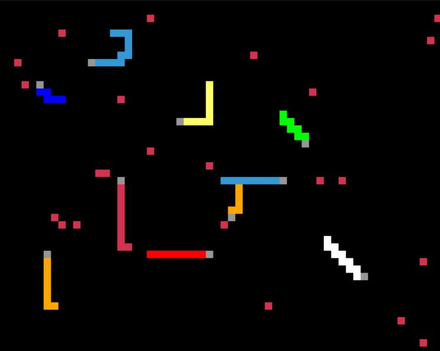
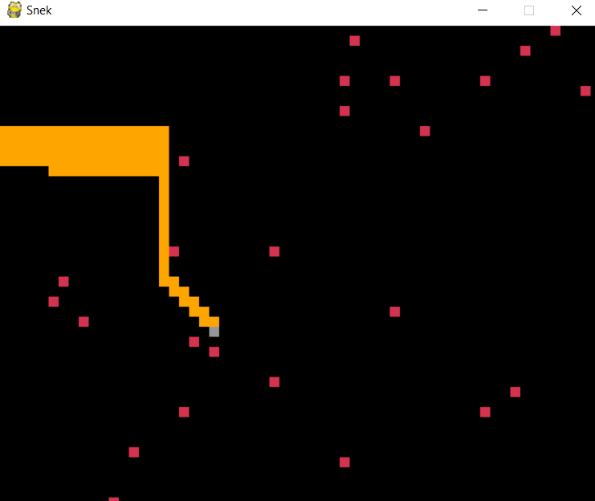
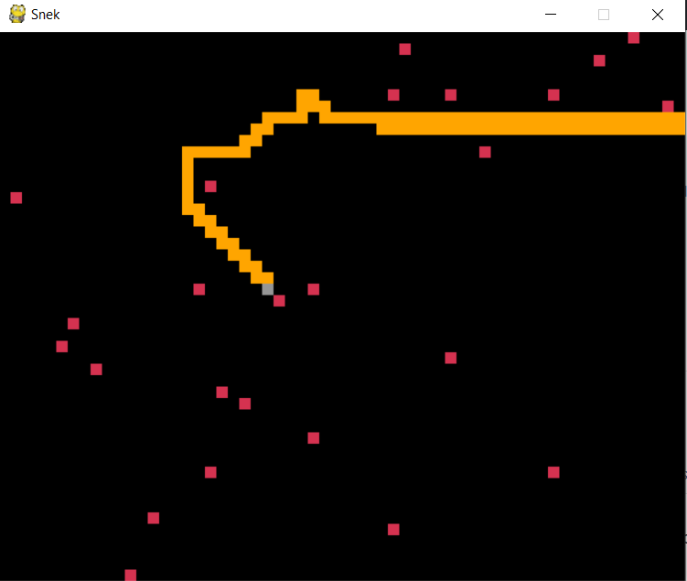

# Snake-Game-and-Decision-Tree-based-Auto-play-Algorithm

###### Created in Python 3, using Py-game 1.9.6.

---
A simple 2D Snake game is present, wherein the task of the snake is to grow by consuming 'food', while avoiding the edges of the window, and it's own body. The human player's Snake achieves this through keyboard input from the user.

Alternatively, the code also contains an algorithm to automatically achieve this, to an extent, I **for any number of snakes and for any speed of the snake(s**).

The implemented **auto-play algorithm** does not use any kind of Deep learning or Artificial Intelligence modelling. It does not use any Search or traversal algorithms.
It is implemented using _if-else decision trees_ and performs satisfactorily, even when a large number of automated snakes are involved.

----
[**Scores.txt**](Scores.txt) automatically stores scores of every playing Snake, along with the **timestamp**, through a score_save() helper function in the code, every time the Game is `Restarted(R)` or `Quit(Q)`.
It also saves Average Score of Snakes, and the Game Parameters(see below) that the Game was played with.

-----

Changeable in-game parameters:
--
1. Whether **human plays** or not.
2. Number of **total Snakes**. 
>*Number of AI Snakes = Total Snakes - (Is Human playing)*
3. Number of **available food** for Snakes.
4. **Friendly Fire:** Whether Snakes can consume other snakes and thereby gain their score.
5.  Whether number of available food is changeable in game
Press `w` to **increase the number of available food** and `s` to **decrease the number of available food**.
6. **Speed** of the Game.

-----
### Usage:
1. Install Python 3.8 and the required Py-Game Library.
2. Scroll down to main() at the bottom of the Snake\Snake+Algo.py code for checking and changing game parameters.
3. Compile and Run.
4. Arrow keys control the snake if `User` variable has been set to **1** in main().
5. Number of available food for Snakes can be increased with `w` and decreased with `s` is `controlled_food` has been set to **1** in main().

  

Suggested commits:
--
1. Further improvements to the algorithm of the Snake (if possible, without implementing techniques like Learning)
2. Inclusion of traits like competitiveness, aggression to the automatic solving algorithm
